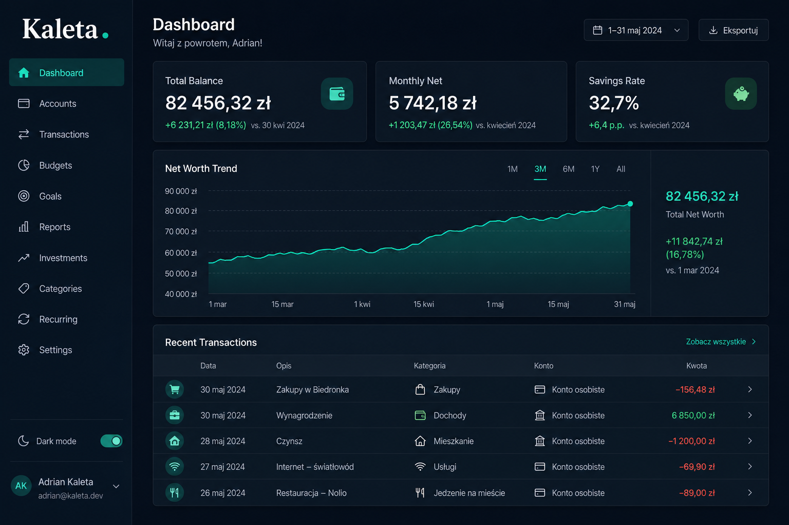

# Kaleta

[](https://github.com/DawidAdamski/kaleta/actions/workflows/ci.yml)
[](https://www.gnu.org/licenses/agpl-3.0)

**Kaleta** (Polish: *leather money pouch*) is a self-hosted personal budget and
finance app. Track transactions, build budgets, import bank CSV exports, and
forecast cash flow — from a browser, desktop window, or headless API.



## Quick start

Requires Python 3.13+ and [uv](https://docs.astral.sh/uv/).

```bash
uv sync && uv run alembic upgrade head && uv run kaleta
```

Open **http://localhost:8080**, create your account on first launch, then sign
in. Optional demo data: `uv run python scripts/seed.py`.

## Documentation

- [Documentation site](https://dawidadamski.github.io/kaleta/) — product guides, architecture, roadmap
- [Getting started](docs/getting-started.md) — Docker, environment variables, development setup
- [Contributing](CONTRIBUTING.md) — how we work and open a PR
- [Security](SECURITY.md) — report vulnerabilities privately

## License

The Kaleta core is licensed under [AGPL-3.0-or-later](LICENSE). External
contributors sign the [Contributor License Agreement](docs/cla.md) before their
first pull request is merged. See [ADR-033](docs/adr/033-agpl-core-with-cla.md)
for the open-core model.
