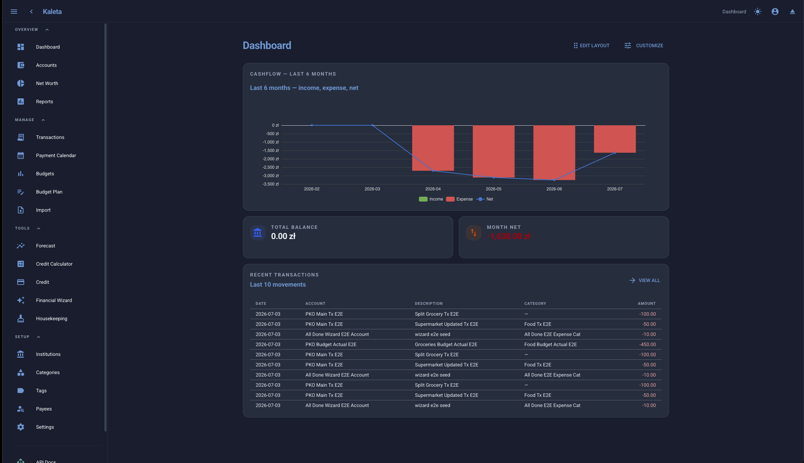

# Kaleta

[](https://github.com/DawidAdamski/kaleta/actions/workflows/ci.yml)
[](https://www.gnu.org/licenses/agpl-3.0)

**Kaleta** (Polish: *leather money pouch*) is a self-hosted personal budget and
finance app. Track transactions, build budgets, import bank CSV exports, and
forecast cash flow — from a browser, desktop window, or headless API.



## Quick start

Requires Python 3.13+ and [uv](https://docs.astral.sh/uv/).

```bash
uv sync && uv run kaleta
```

On first launch the browser opens at **/setup** — pick **Use recommended
location** (or choose a custom path) and Kaleta creates the database and runs
migrations. Later starts auto-upgrade the configured DB (from
`~/.kaleta/config.json`) to the installed schema, with a SQLite safety copy
under `~/.kaleta/backups` first. Create your account, then sign in. Optional
demo data: `uv run python scripts/seed.py` — six years of transactions
named by merchant and tagged by payment method, with budgets, assets and
a payment calendar of recurring commitments.

Manual migrate (targets the live DB — bare `alembic upgrade head` uses
`KALETA_DB_URL` / cwd `kaleta.db`, which may differ from the configured one):

```bash
KALETA_MIGRATE_URL=sqlite+aiosqlite:///$HOME/path/to/kaleta.db uv run alembic upgrade head
```

## Hosted Kaleta

A hosted instance (Supabase sign-in, one account per household) is being
rolled out; its address will be listed here once it is public. **The privacy
promise:** everything you write — descriptions, payees, categories, names,
notes — is encrypted under a key that only your data passphrase or recovery
code opens, and only in the server's memory while you are signed in. The
operator, a database dump and every backup see ciphertext for that text, and
plain amounts and dates. Deleting your account removes its data and your
sign-in. Details: [docs/privacy.md](docs/privacy.md); running one yourself:
[docs/deployment.md](docs/deployment.md).

## Optional forecasting

The Forecast view works out of the box with a seasonal-naive projection.
For the advanced model, install [Prophet](https://facebook.github.io/prophet/)
as an optional extra (~300 MB with cmdstan) and restart:

```bash
uv sync --extra forecast
```

Docker users: the `kaleta:full` image ships Prophet; `kaleta:slim` uses
the naive fallback.

## Documentation

- [Documentation site](https://dawidadamski.github.io/kaleta/) — product guides, architecture, roadmap
- [Getting started](docs/getting-started.md) — Docker/Podman volumes, environment variables, development
- [Hosted deployment (Supabase)](docs/deployment.md) — multi-tenant instance, operations, hosted-dev stack, demo
- [Privacy](docs/privacy.md) — what is encrypted, anonymous error events, retention, bug reports
- [Local deploy (launchd / systemd)](docs/deploy-local.md) — autostart on localhost + `/api/v1/health`
- [Contributing](CONTRIBUTING.md) — how we work and open a PR
- [Security](SECURITY.md) — report vulnerabilities privately

## License

The Kaleta core is licensed under [AGPL-3.0-or-later](LICENSE). External
contributors sign the [Contributor License Agreement](docs/cla.md) before their
first pull request is merged. See [ADR-033](docs/adr/033-agpl-core-with-cla.md)
for the open-core model.
